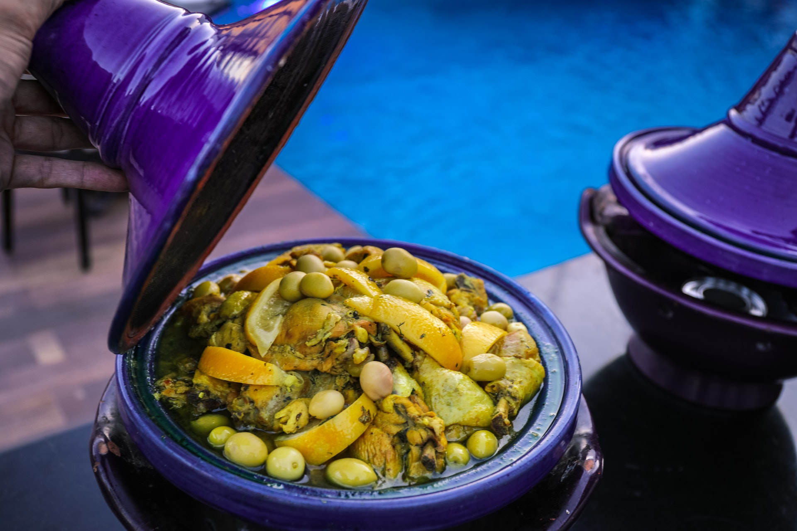

# 🍲 Wasafati - Moroccan Cuisine Guide



## About The Project

Wasafati is your ultimate guide to authentic Moroccan cuisine. Built with passion for sharing traditional Moroccan recipes and cooking techniques with the world.

### Features

- 📱 Fully responsive design
- 🔍 Recipe search functionality
- 🏷️ Category filtering
- 📖 Detailed recipe instructions
- 🖨️ Print-friendly recipe pages
- 💫 Social sharing integration
- 📱 Mobile-first approach

### Built With

- HTML5
- CSS3
- JavaScript
- Font Awesome Icons
- Google Fonts

## Getting Started

To run this project locally:

```bash
# Clone the repository
git clone https://github.com/yourusername/wasafati.git

# Navigate to the project directory
cd wasafati

# Open index.html in your browser
```

## Website Structure

- Homepage: Featured recipes and categories
- Recipes: Searchable recipe collection
- Single Recipe Pages: Detailed instructions and ingredients
- About: Project information
- Contact: Feedback and inquiries form

## Featured Recipes

- 🍗 Chicken Tagine
- 🥧 Moroccan Pastilla
- 🍜 Harira Soup

## Upcoming Features

- More traditional recipes
- Video tutorials
- Recipe rating system
- User comments
- Recipe sharing community

## Author

**Hamza**
- GitHub: [@yourgithubusername](https://github.com/yourgithubusername)
- Website: [wasafati.com](https://wasafati.com)

## Contributing

Contributions are welcome! Feel free to open an issue or submit a pull request.

1. Fork the Project
2. Create your Feature Branch (`git checkout -b feature/AmazingFeature`)
3. Commit your Changes (`git commit -m 'Add some AmazingFeature'`)
4. Push to the Branch (`git push origin feature/AmazingFeature`)
5. Open a Pull Request

## License

Distributed under the MIT License. See `LICENSE` for more information.

## Contact

Hamza - [@yourtwitter](https://twitter.com/yourtwitter)

Project Link: [https://github.com/yourusername/wasafati](https://github.com/yourusername/wasafati)

## Acknowledgments

- [Font Awesome](https://fontawesome.com)
- [Google Fonts](https://fonts.google.com)
- All the Moroccan moms and grandmothers who inspired these recipes
